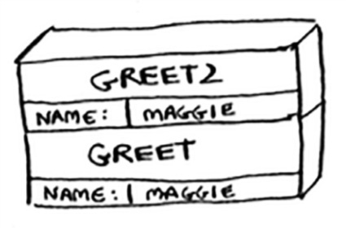

1. Suppose I show you a call stack like this:

  

  What information can you give me, just based on this call stack?

  > Based on this call stack, we can see that the first function invoked was called `greet`, and contained a variable named `name`, whose value was `maggie`. This `greet` function called another function, `greet2`, which retained the variable `name` and its value `maggie`. At the point in time at which this call stack was captured, the `greet2` function has not yet finished.

2. Suppose you accidentally write a recursive function that runs forever. As you saw, your computer allocates memory on the stack for each function call. What happens to the stack when your recursive function runs forever?

  > When a recursive function runs forever, the call stack continues to grow, eating up the system's memory. Eventually, the system will run out of available memory, causing an error to occur.
